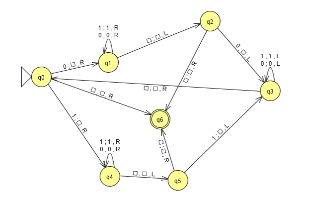

# Proyecto final - Máquina de Turing

## Introducción

En este proyecto se desarrolla una simulación de una máquina de Turing diseñada para reconocer o rechazar cadenas palíndromas compuestas por el alfabeto {0, 1}, siguiendo las transiciones y estados definidos por un autómata finito no determinista.

## AFND

## Ejecución del programa

python [main.py](http://_vscodecontentref_/1)

## Entrada

**Simulación paso a paso en la terminal**
En la terminal se pedirá al usuario que introduzca una cadena formada por el alfabeto {0, 1}.

## Salida

A partir de esa entrada, se mostrará el flujo de ejecución de la máquina de Turing, visualizando en cada paso:
- El símbolo que está siendo leído y cómo es reescrito, ya sea por un símbolo blanco (□) o uno diferente.
- El estado actual del autómata (AFND) en el que se encuentra la máquina.
- La posición del cabezal sobre la cinta.
- La representación visual de la cinta, con las transiciones aplicadas según la función de transición del AFND.

Este proceso permitirá seguir detalladamente la ejecución, entendiendo cómo la máquina decide aceptar o rechazar una cadena palíndroma.

## Cadena aceptada
Si una cadena es aceptada por el autómata, al final de todos los pasos veremos el siguiente mensaje: **Cadena aceptada. Estado final: ACEPTACION**
## Cadena rechazada
En caso de que la cadena es rechazada veremos el siguiente mensaje al final de todos los pasos: **Transición no definida. Cadena rechazada.**